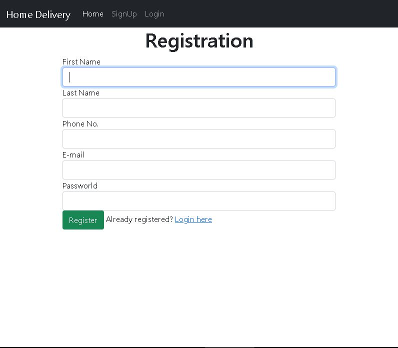

# Mini-Delivery-App

This repository has a sample mini delivery app developed using spring framework to support spring framework tutorial.

## Screenshots
### Registration Page

### Loging Page

### User Dashboard

### Item Order Page

### PickUP Information

### Destination Information Page

### Order Confirmation Page

## Tech Stack

**Client:** Thymeleaf

**Server:** Spring framework Spring Boot

## Development Environment 
- Intellij 
## Programming Language 
- Java (Spring Framework Spring Boot)
- Html
## Features

- User Registration 
- Login
- Order Item
- Add Pickup Information
- Add Destination Information
- Display for confirmation
- Display orders in User Dashboard

## About
- Ethio Clicks: https://ethioclicks.com/
- Software engineer : Samrawit Ayalew
